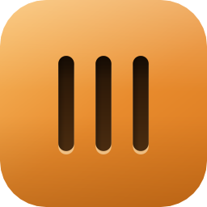
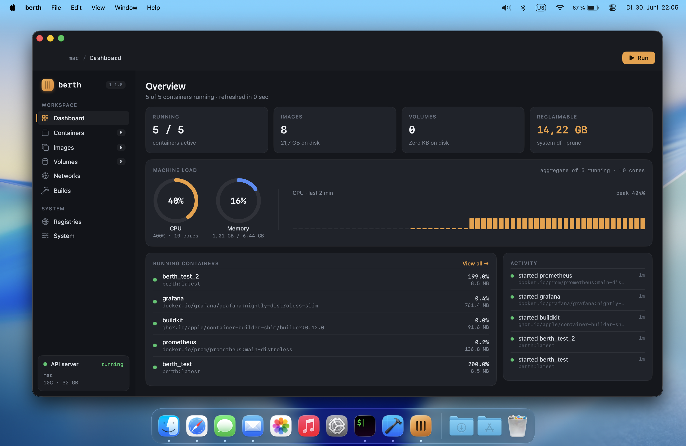
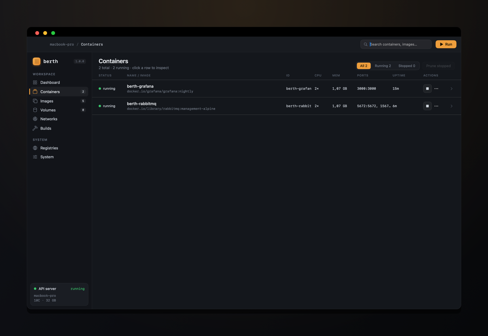
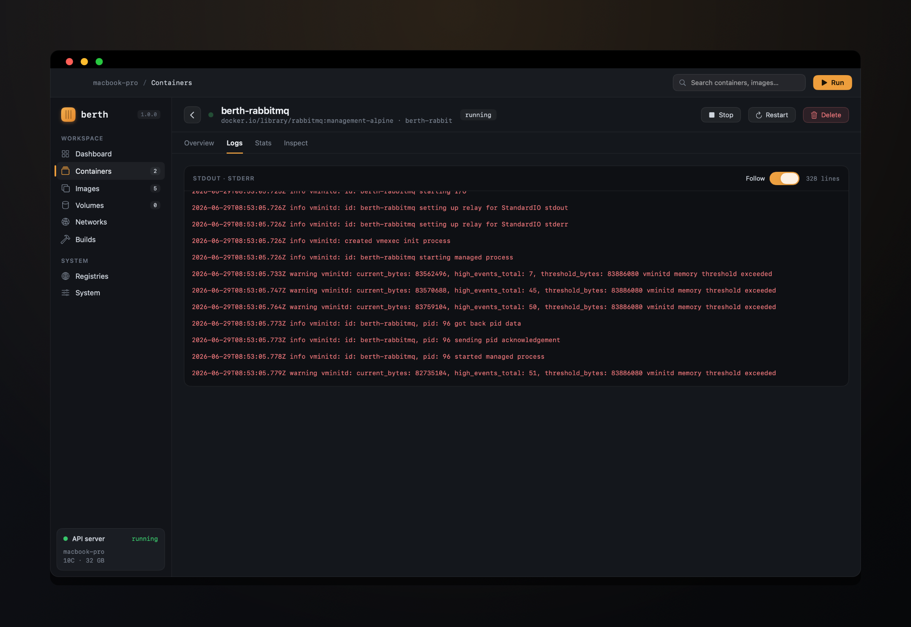
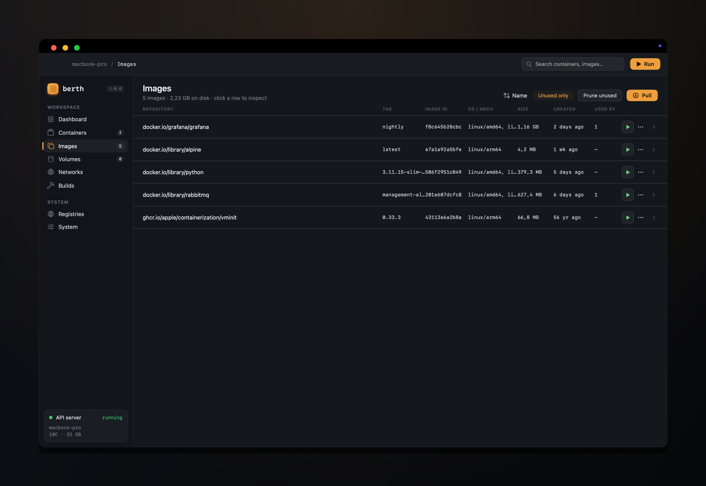
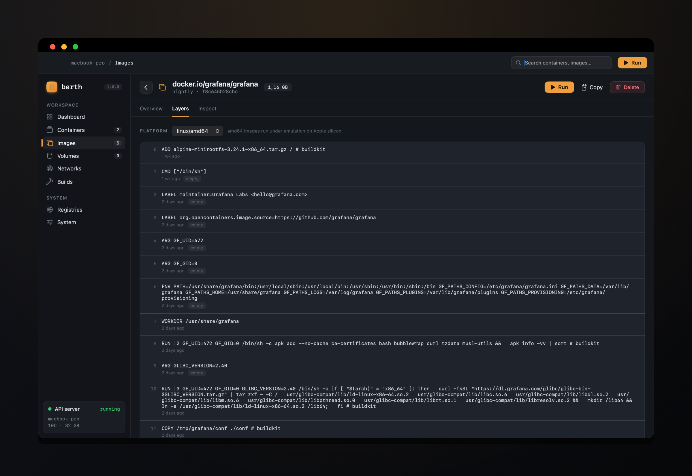

<p align="center">
  
</p>

<h1 align="center">berth</h1>

<p align="center">
  A native macOS app for managing Linux containers with <a href="https://github.com/apple/container"><code>apple/container</code></a>.
</p>

<p align="center">
  
  
  
  
</p>

---

**berth** is an open-source, Docker-Desktop-style GUI for [`apple/container`](https://github.com/apple/container) — Apple's tool for running Linux containers as lightweight per-container virtual machines on Apple silicon. It talks to the same engine the `container` CLI uses, **natively over XPC** through Apple's own Swift client library — no daemon, no socket, no shelling out for the hot paths. The result is real streaming logs, live stats, and typed data, in a clean native Mac interface.

<p align="center">
  
</p>

## Features

berth covers the day-to-day container workflow across eight screens:

- **📊 Dashboard** — live overview that polls while visible: running/total counts, image & volume disk usage, reclaimable space, aggregate **CPU and memory donut gauges**, a rolling CPU history chart, and panels for running containers and recent activity.
- **📦 Containers** — searchable, filterable list (All / Running / Stopped) with one-click **start, stop, kill, restart, delete**, and prune-stopped. The detail view has four tabs:
  - *Overview* — configuration, networking (IP, gateway, MAC, ports), mounts and environment.
  - *Logs* — **live-streamed** stdout/stderr (stderr in red) with a follow toggle.
  - *Stats* — **live** CPU / memory / network / PID metrics plus a CPU chart.
  - *Inspect* — pretty-printed JSON of the raw snapshot.
- **🖼️ Images** — list with size, OS/arch and "used by" counts; search, *Unused only* filter, and sort by name/size/date. **Pull** with real progress bars, **delete**, and **prune** (including orphaned content-store blobs). The detail view shows the OCI config, **layer history** (with a multi-arch platform picker) and raw JSON, and you can launch a container straight from an image.
- **💾 Volumes** — list with driver, size, mount point and "used by" counts; **create**, **delete** and **prune** unused volumes.
- **🌐 Networks** — list vmnet networks with subnet, gateway and attachment counts; **create** NAT networks and **delete** non-default ones.
- **▶️ Run** — a `container run` builder modal: image, name, platform, environment variables, published ports (with UDP), CPU/memory, and `--rm` / `--read-only` / `--rosetta` toggles, with a **live command preview** that exactly matches what gets executed.
- **⚙️ System** — engine status, version and paths; **start / stop / restart** the engine; storage usage and blob pruning; host info.
- **🔐 Registries** — manage registry logins stored in the macOS **keychain** (the same one the CLI uses): add, list and log out.

A **global search** box filters containers, images, volumes, networks and registries from anywhere.

> **Builds** is not yet implemented — image building uses a separate gRPC `container-builder-shim` path and is currently a placeholder.

### A closer look

<table>
  <tr>
    <td width="50%"></td>
    <td width="50%"></td>
  </tr>
  <tr>
    <td align="center"><em>Containers — list, filters &amp; lifecycle actions</em></td>
    <td align="center"><em>Live logs streamed straight from the engine</em></td>
  </tr>
  <tr>
    <td width="50%"></td>
    <td width="50%"></td>
  </tr>
  <tr>
    <td align="center"><em>Images — pull, prune &amp; inspect</em></td>
    <td align="center"><em>Per-image layer history &amp; multi-arch picker</em></td>
  </tr>
</table>

## How it works

`container` is not a daemon with a socket — it is a launchd-managed XPC service tree built on the [`containerization`](https://github.com/apple/containerization) package, running one lightweight VM per container via Virtualization.framework. berth adds `apple/container` as a Swift Package dependency and calls its `public` async client types directly:

- A single **`actor ContainerService`** is the only thing that touches the client library. All engine I/O and JSON decoding happen off the main actor; `@Observable` per-screen stores (on the main actor) consume `Sendable` results.
- **Streaming is native**: logs arrive as `FileHandle`s turned into an async stream, pull progress comes over an XPC progress channel, and stats are polled on a timer — no stdout parsing.
- Two things deliberately shell out to the `container` CLI: the **Run** builder (the engine handles image/kernel/snapshot setup) and **engine lifecycle** (`container system start`/`stop`). Everything else is the native XPC client.
- Charts are hand-rolled, so there's no dependency on the SwiftUI Charts framework.

## Requirements

- A **Mac with Apple silicon** running **macOS 26 (Tahoe)** — `container`'s full feature set (e.g. network creation) requires macOS 26.
- [`apple/container`](https://github.com/apple/container) installed, with the engine running:
  ```sh
  container system start
  ```
- **Xcode 26** to build.

> berth's Swift Package dependency is pinned to `apple/container` **1.0.0** (`containerization` 0.33.3). The dependency must match your installed engine version — berth performs a version handshake at launch and warns on a mismatch.

### A note on the App Sandbox

berth runs **without the App Sandbox** (like Docker Desktop), with the Hardened Runtime on. This is required: the App Sandbox blocks the global Mach lookup to `com.apple.container.apiserver`. The apiserver only authorizes inbound connections by matching the client's effective UID — no special entitlement is involved — so any GUI app running as the same user can connect.

## Building & running

```sh
# Open in Xcode and press ⌘R, or build from the command line:
export DEVELOPER_DIR=/Applications/Xcode.app/Contents/Developer
DD=/tmp/berth-dd   # any path outside the repo

xcodebuild -project berth.xcodeproj -scheme berth -configuration Debug \
  -destination 'platform=macOS,arch=arm64' -derivedDataPath "$DD" build

open -n "$DD/Build/Products/Debug/berth.app"
```

### Headless verification

A DEBUG-only self-test harness exercises the real service/store data paths against the live engine and exits — handy for CI or a quick smoke test without launching the UI:

```sh
BERTH_SELFTEST=1 "$DD/Build/Products/Debug/berth.app/Contents/MacOS/berth"
```

## Project layout

```
berth/
├─ App/            AppModel composition root, RootView
├─ Navigation/     sidebar & routing
├─ Service/        ContainerService actor, EngineConnection, SystemControl, Streaming/
├─ Models/         Sendable view-models & UIModels extensions
├─ DesignSystem/   theme, fonts, components (incl. hand-rolled charts)
└─ Features/       Dashboard, Containers, Images, Volumes, Networks, Run, System, Registries
```

The Xcode project uses a **file-system-synchronized group**: any file added under `berth/` automatically joins the target.

## Acknowledgements

berth is built on Apple's [`container`](https://github.com/apple/container) and [`containerization`](https://github.com/apple/containerization) projects (Apache-2.0). It is an independent, community project and is **not affiliated with or endorsed by Apple**.

## License

[MIT](LICENSE) © Falco Tomasetti
